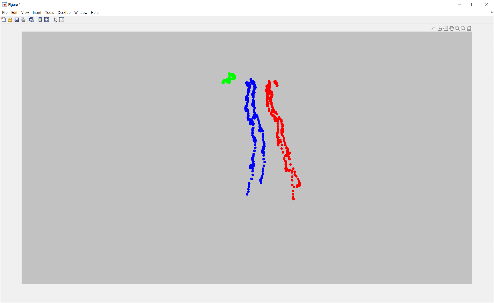
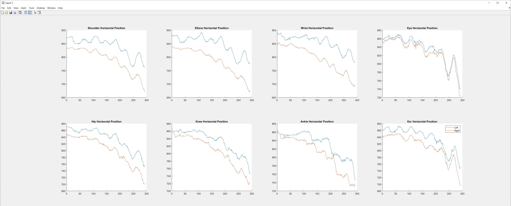

# Preamble
This repository contains MATLAB code used to calculate gait features from joint trajectories (obtained using human pose-estimation libraries, currently OpenPose, AlphaPose and Detectron). The gait features can be used for downstream analyses, including as input to our ST-GCN models for assessing parkinsonism severity in gait: https://github.com/TaatiTeam/stgcn_parkinsonism_prediction.

# Installation
This project requires MATLAB (tested with R2020b on Windows 10 and Ubuntu 20.04). The following toolboxes are also needed:

```
image_toolbox
signal_toolbox
statistics_toolbox
```

After opening MATLAB, ensure that all subfolders are added to the path (right-click on folder names in Current Folder tab on left of UI, then select "Add to Path -> Selected Folders and Subfolders")

This library is intended to run using MATLAB utilities, but on Ubuntu (and less frequently on Windows), the built-in MATLAB video reading/writing may fail for some video formats. To try to improve cross-platform compatibility, you will need to install ffmpeg and specify the path in the MATLAB script where marked. 


# Data Preparation
This library includes code for transforming  output from pose-estimation libraries (AlphaPose, Detectron, OpenPose) to clean and filtered joint trajectories, and ultimately into gait features. However, the input data from the raw output from different pose-estimation libraries must first be standardized into a format that is usable by Matlab. 

To preprocess the output from your pose-estimation library to the format required by this library, please refer to the [preprocessing document](python_csv_format/README.md). 
# Joint Trajectory Extraction
After preprocessing the data into the expected input data format, the core Matlab utilities of this library can be used to join the tracked data into trajectories, to manually select the trajectory that corresponds to the person of interest, and to fix any artifacts (left-right mislabels) left by the pose-estimation libraries.  
*Note that the input data format required for this step can be found in the `sample_data/raw_posetracking` folder.*

## Joint Trajectory Joining
Code for all core functionality provided by this library can be found in the `calculate_features_main.m` file.  
The provided version is configured to process the sample data provided and should be first run to ensure that Matlab and all required toolboxes are correctly installed. 

The joint trajectory and participant labelling can be controlled with two key variables:
```
configs.do_labelling = 1;       % Should we create joint trajectories and label the participant?
configs.do_discont_check = 1;   % Should we fix the discontiuities and flips in the trajectory?
```
If you do not need to do the joint trajectory joining, participant selection, and processing the data into clean trajectories, you can disable these steps by setting these variables to `0`. 
Alternatively, this can also be disabled by commenting out the following line:
```
configs = joinTrajectoriesAndLabel(configs);
```
For large datasets, it is often necessary to pause and continue data processing at a later time. To facilitate this, it is vital that we do not reprocess the same walk using the following variable:
```
configs.labelling_configs.skip_if_epart_file_exists = 1; % Turn this on to avoid re-labelling walks (but turn off if re-processing with new configuration)
```
After the trajectories are joined internally, it is necessary to manually select the trajectory which corresponds to the participant of interest. This library provides a simple command-line utility and a tool to plot the trajectories in different colours over a frame from the video. A sample image of this functionality is shown below (Note: a gray rectangle was used to replace each frame of the input video in this example for privacy reasons)



## Fixing Discontinuity and Lateral Flipping
In our work and datasets, we noticed that pose-estimation libraries sometimes misidentified the right and left sides of the body. To correct these issues, we have developed a suite of automated and manual tools for removing these discontinuities and manually fixing flips (if desired). This functionality can be controlled by the following line of code:
```
configs = fixDiscontinuitiesAndFlips(configs);  # Comment out to turn off automatic discontinuity correction
```
The `DiscontConfigs.m` file can be used to adjust the parameters for the automated discontinuity identification and flip correction.  
Analogously, the `FixFlipConfigs.m` file controls any parameters for the manual flip correction.  
A simple command-line interface is used to control the manual correction steps. A sample interface of this interface is shown below.



# Calculation of Gait Features
The gait feature calculation utilities expects that you have already extracted joint trajectories using a human pose-estimation library and have preprocessed it to create a clean trajectory representing the person of interest. Note that these joint trajectories can be generated using the code in this library, as documented under the [Joint Trajectory Extraction](#Joint-Trajectory-Extraction) section. An example of the sample input data format can be found in the `sample_data/FINAL_trajectories` folder. Note that we have provided examples of both raw (uninterpolated and unfiltered) and interpolated versions of the trajectories. It is not necessary to provide both, but you should provide at least one and specify which one to use in `calculate_features_main.m`. 

## Sample Data
After installing MATLAB and preparing all joint trajectories into the format specified in `sample_data/FINAL_trajectories`, you should begin by running the `calculate_features_main.m` file. If you do not wish or need to re-prepare the joint trajectories, the following lines should be commented out to avoid re-processing data: 
```
configs = joinTrajectoriesAndLabel(configs);
configs= fixDiscontinuitiesAndFlips(configs);
```

If there are no errors and everything runs correctly, you should have two new folders in the `sample_data` directory (`gait_features` and `centred_at_100`).

## Custom Dataset
After confirming that everything is working as expected on the sample dataset, you can add additional configurations for your datasets (if needed). 
To add a custom dataset, begin by uncommenting the following line in `calculate_features_main.m`:
```
dataset_name = "CUSTOM"; 
```
*Note: you will also need to make the appropriate changes to getWalkAndPatientID in the PosetrackerConfigs class to specify how your input CSV files are named and how any dataset-specific parameters should be set.*

Next, specify the location of the data you would like to process:
- If you are processing raw data and will be doing trajectory joining and lateral flip correction, specify the input path in the `in_path` variable. 
- If you already have preprocessed joint trajectories, specify the input path to them using the `out_path` variable. 

```
out_path = "sample_data/";   % Change out_path to the input location of your joint trajectories. Note that they should be placed in a subfolder called `FINAL_trajectories`. 
```

Next, specify the name(s) of the pose-estimation libraries you would like to process. Currently only OpenPose, AlphaPose, and Detectron have been used and tested, but you can add additional detectors here if needed. 

```
configs.detectors = {'alphapose', 'openpose', 'detectron'};  % TODO: change this as needed
```

There are three options for the method of heel-strike detection to use when calculating gait features.
- "original": This method labels the heelstrikes at 35% of the peak vertical velocity of the ankles
- "DBSCAN": This method uses spatial-temporal density-based spatial clustering for applications with noise to identify the heelstrikes
- "manual": This method reads in CSV files with the frames of the heelstrikes in each video. CSV files for this method can be generated manually or using this library: https://github.com/andreasabo-ibbme/step_labeller

The heelstrike annotation method(s) can be selected by changing the following statement: 
```
ft_configs = GaitFeatureConfigs(["DBSCAN", "original"], dataset_name); 
```
Note: For consistency with the models trained in the https://github.com/TaatiTeam/stgcn_parkinsonism_prediction project, the 'original' heel-strike annotation method should be used. 

# Exporting data for ST-GCN models
This library also provides functionality for exporting joint trajectories centred at (100, 100) for use in our pretrained ST-GCN models for parkinsonism prediction. The code to do this is provided at the bottom of the `calculate_features_main.m` file:
```
is_kinect = 0;
is_3D = 0;
export_configs = ExportConfigs(fullfile(out_path, 'centred_at_100'), is_kinect, is_3D);
export_configs.center_hip = 1;
reference_file = fullfile(ft_configs.output_root, "alphapose_original.csv");
centreCSVsat100(configs, export_configs, "raw", reference_file); % This will interpolate and filter the raw (alternatively, can just pass in the clean data and these operations are redundant)
```
The included configuration is for raw joint trajectories (this function will also interpolate and filter the data). We use the calculated gait feature file to read in the identifiers of the partipants and their walks to avoid re-parsing video names. If you did not export gait features with AlphaPose and the "original" heelstrike annotation method, change the `reference_file` to a gait feature file that exists. 

# Citation
Please cite our paper if this library helps your research:
```
@article{sabo2020assessment,
  title={Assessment of Parkinsonian gait in older adults with dementia via human pose tracking in video data},
  author={Sabo, Andrea and Mehdizadeh, Sina and Ng, Kimberley-Dale and Iaboni, Andrea and Taati, Babak},
  journal={Journal of neuroengineering and rehabilitation},
  volume={17},
  number={1},
  pages={1-10},
  year={2020},
  publisher={BioMed Central}
}
```  